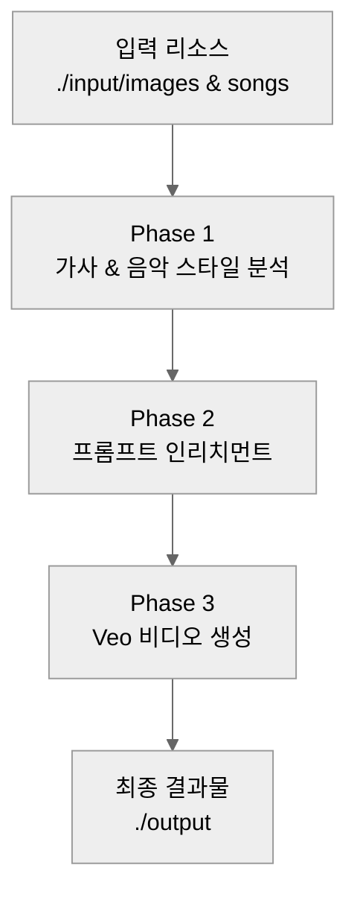
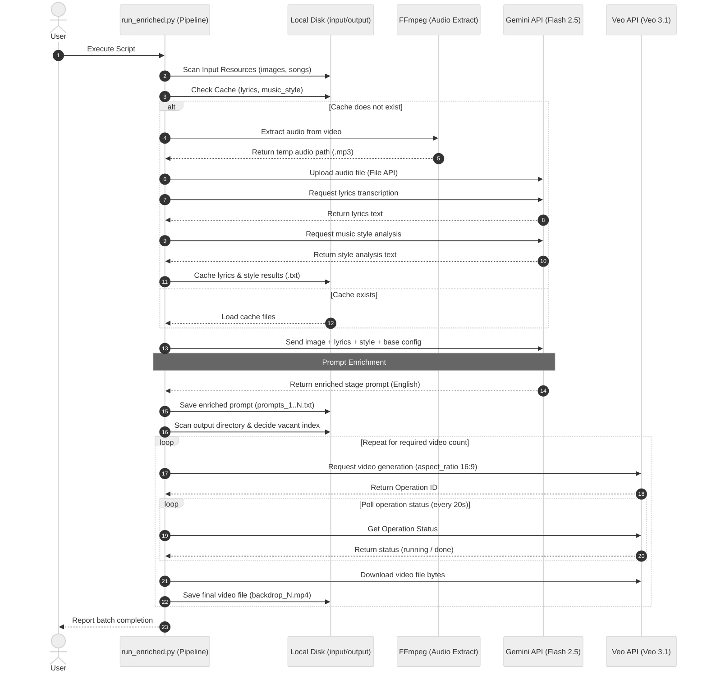
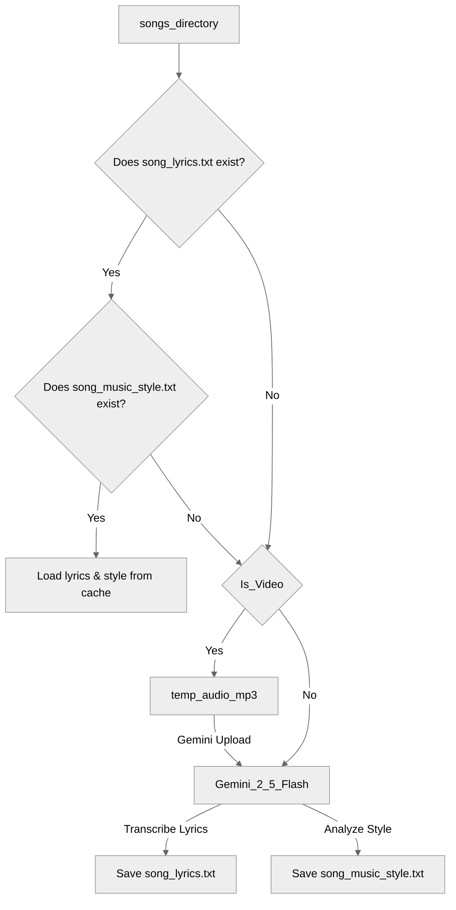
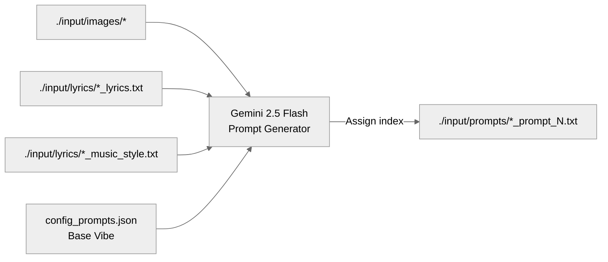
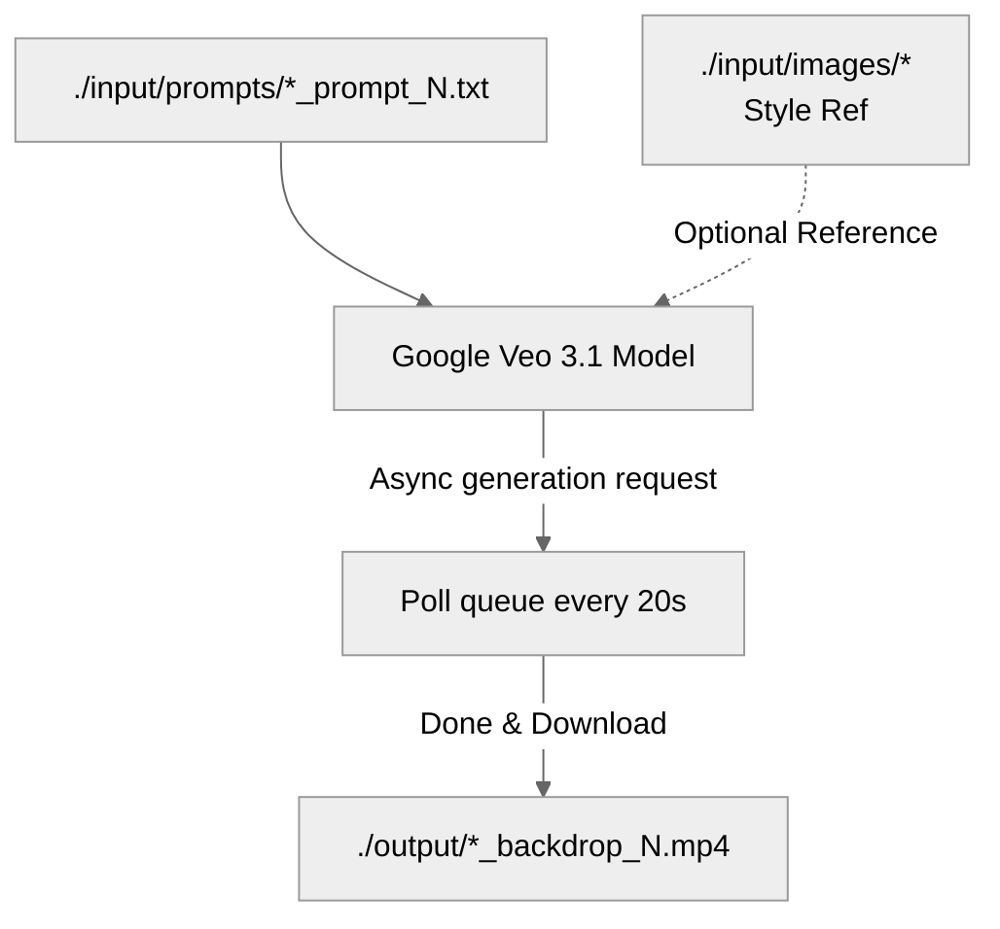
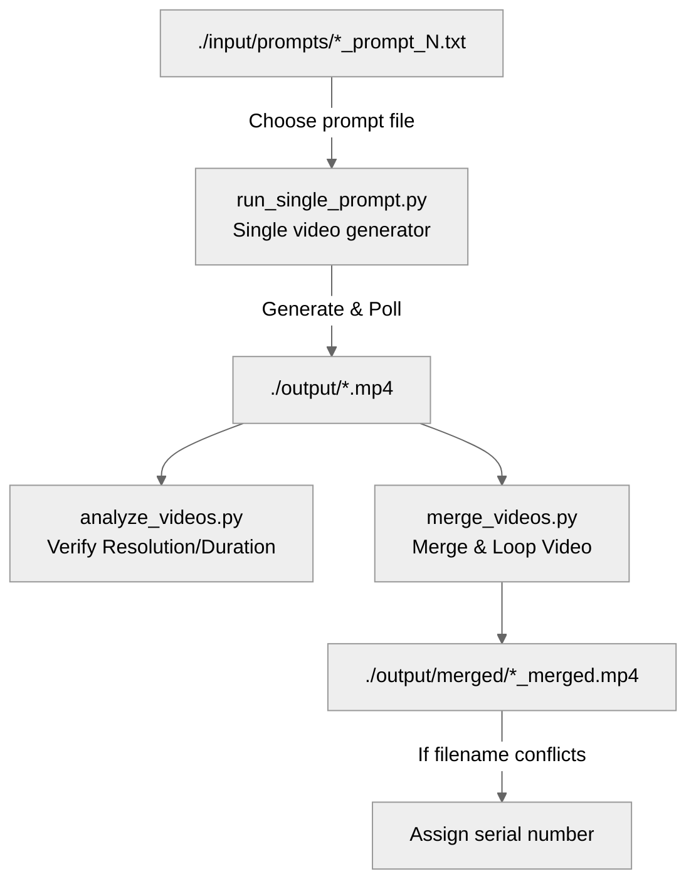

# AI-Powered Concert Stage Backdrop Generator Architecture

복잡한 전체 흐름을 한눈에 파악할 수 있도록 전체 파이프라인 개요도와 단계별 상세 구조로 나누어 정리했습니다. 본 문서는 종이 인쇄 및 PDF 변환 시의 가독성을 최적화하여 설계되었습니다.

---

## 1. 전체 시스템 개요 (High-Level Pipeline)

입력 파일이 어떤 과정을 거쳐 최종 콘서트 무대 영상으로 변환되는지 보여주는 핵심 파이프라인입니다.

| 단계 | 주요 역할 | 핵심 도구 및 모델 | 입출력 경로 |
| :--- | :--- | :--- | :--- |
| **Phase 1** | 오디오 추출, 가사 및 스타일 분석 | FFmpeg, Gemini 2.5 Flash | `./input/songs/` -> `./input/lyrics/` |
| **Phase 2** | 무대 연출용 상세 프롬프트 생성 | Gemini 2.5 Flash (Multimodal) | `./input/images/` -> `./input/prompts/` |
| **Phase 3** | 1080p 16:9 무대 배경 영상 생성 | Veo 3.1 Model | 프롬프트 -> `./output/` |

## 1.5 전체 시스템 시퀀스 다이어그램 (Sequence Diagram)

다음은 사용자 요청부터 오디오 가공, Gemini 멀티모달 분석, Veo 비디오 비동기 생성 및 로컬 저장까지의 컴포넌트 간 상호작용 시퀀스입니다.

## 2. 단계별 상세 흐름도 (Detailed Phase Flow)

### Phase 1: 오디오, 가사 및 음악 스타일 분석 (Audio, Lyrics & Music Style Analysis)
비디오 파일에서 음원을 분리(또는 원본 오디오 탐지)하여 가사를 전사하고 스타일(분위기, 템포, 색상 등)을 분석합니다. 캐시 파일이 존재하면 로컬 데이터를 재사용합니다.

---

### Phase 2: 멀티모달 프롬프트 생성 (Prompt Enrichment)
스타일 레퍼런스 이미지와 추출된 가사, 음악 스타일 정보, 기본 콘티를 결합하여 Veo 모델에 최적화된 100~150단어 분량의 세부 시각 프롬프트를 작성합니다.

---

### Phase 3: 고화질 비디오 생성 (Veo Video Generation)
작성된 프롬프트를 Veo 모델에 전달하여 1080p 해상도의 비디오를 생성합니다. 기존 생성된 비디오 파일의 개수를 파악하여 설정된 개수(`num_outputs`)만큼 비어있는 인덱스로 안전하게 생성합니다.

## 3. 유틸리티 및 후처리 구조 (Post-Processing)

생성된 비디오 검증 및 연속 재생을 위한 최종 편집, 그리고 개별 비디오 추가 생성 단계입니다.

또한, 이미 저장된 프롬프트가 존재할 경우 전체 파이프라인(가사 추출 및 스타일 분석 등)을 실행할 필요 없이 `run_single_prompt.py`를 활용하여 특정 프롬프트로 원하는 수량만큼 비디오를 바로 추가 생성할 수 있습니다.

## 4. 디렉토리 구조 매핑

| 폴더명 | 용도 | 설명 |
| :--- | :--- | :--- |
| **`./input/images/`** | 스타일 레퍼런스 | 배경 영상의 색감과 분위기를 지정하는 이미지 자산 보관 |
| **`./input/songs/`** | 원본 참고 미디어 | 곡별 음원 및 영상 입력 파일 (.mp4, .mov, .mp3, .wav 등) |
| **`./input/lyrics/`** | 텍스트 캐시 폴더 | 분석 완료된 가사 및 스타일 분석 결과 영구 저장 및 재사용 |
| **`./input/prompts/`** | 프롬프트 아카이브 | 생성 시마다 회차별로 기록되는 연출 프롬프트 저장 및 이력 관리 |
| **`./scratch/`** | 임시 작업 폴더 | FFmpeg로 추출한 임시 오디오(`.mp3`) 파일 임시 저장 |
| **`./output/`** | 렌더링 출력 | Veo가 생성한 곡별 최종 1080p 배경 비디오 보관 |
| **`./output/merged/`** | 최종 상영용 병합 | 여러 비디오들이 크로스페이드로 결합된 연속 무대 영상 보관 |
