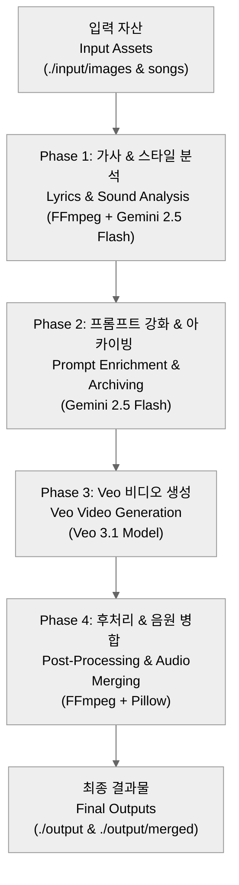
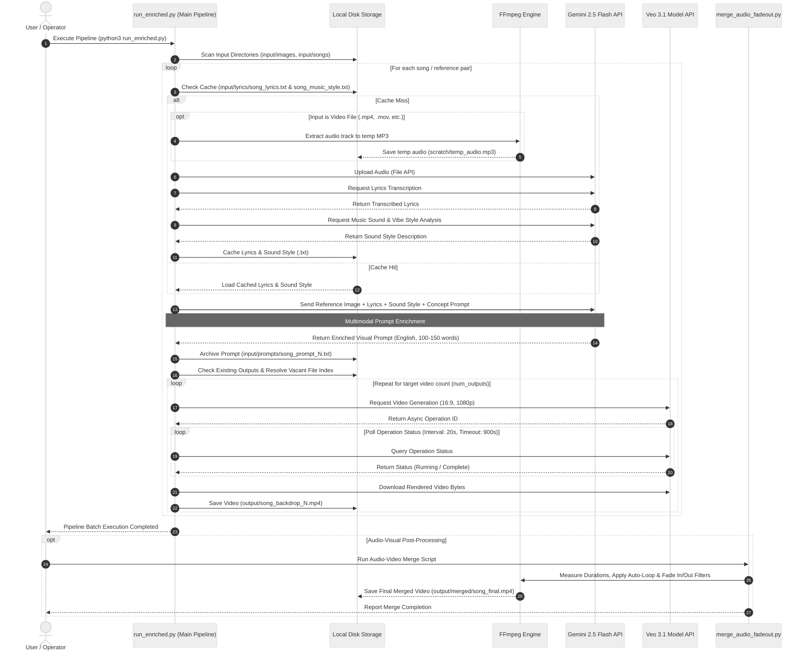
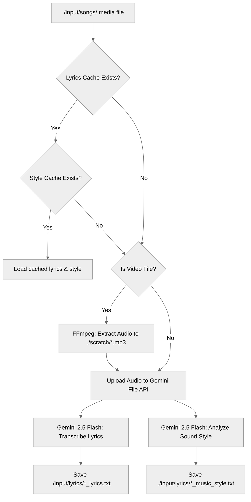
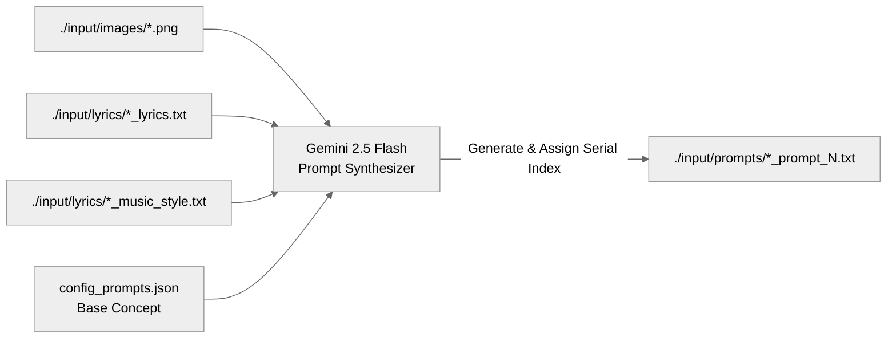
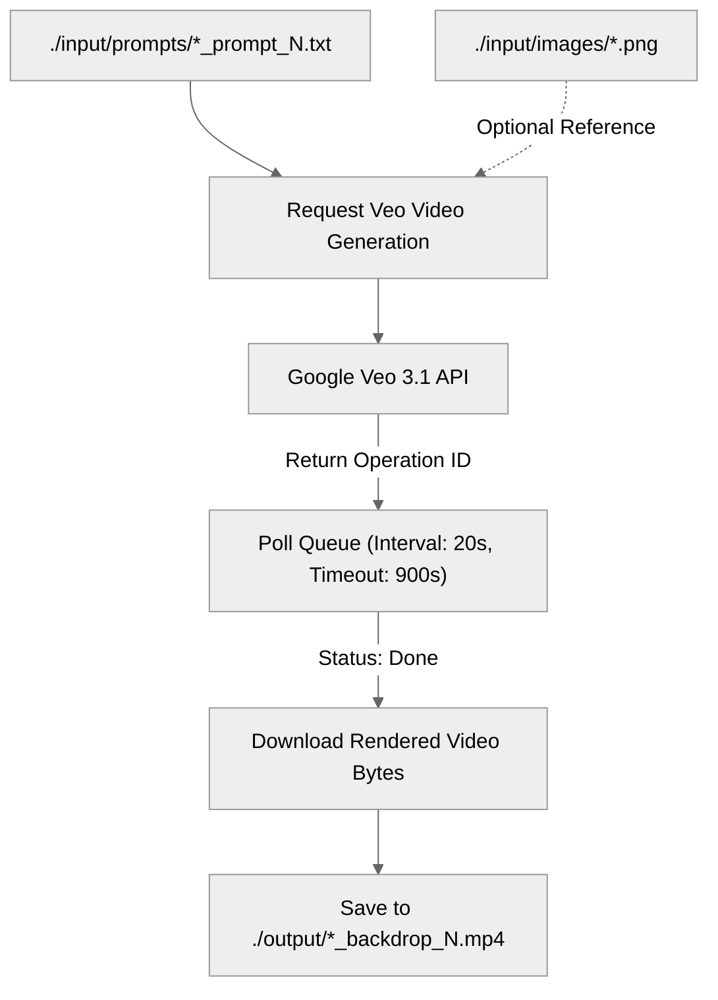
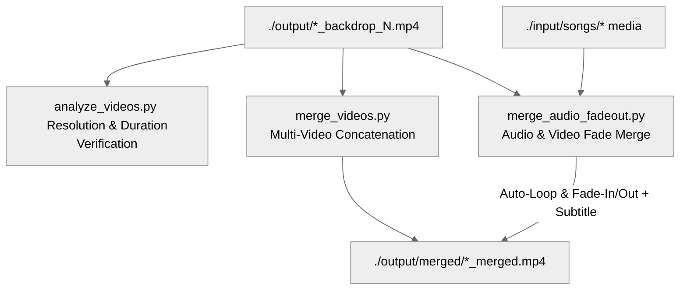

# AI 기반 콘서트 무대 백월 영상 생성기 아키텍처 문서
# Architecture Specification: AI-Powered Concert Stage Backdrop Generator

본 문서는 Google Gemini 및 Veo 모델을 활용한 콘서트 무대 배경(Stage Backdrop) 비디오 자동화 생성 시스템의 엔드투엔드(End-to-End) 아키텍처 및 모듈 구조를 명세합니다.

This document specifies the end-to-end architecture and modular structure of the automated concert stage backdrop video generation system powered by Google Gemini and Google Veo models.

---

## 1. 전체 시스템 개요 (High-Level System Overview)

본 시스템은 원본 참고 미디어(음원/영상)와 스타일 이미지 자산을 분석하여 무대 연출용 최적화 프롬프트를 생성하고, 고해상도(1080p 16:9) 백월 영상을 생성 및 후처리하는 4단계 파이프라인으로 구성되어 있습니다.

The system is structured as a 4-phase pipeline that analyzes reference media and style assets, synthesizes optimized stage visual prompts, generates high-definition (1080p 16:9) backdrop videos, and performs post-processing audio-visual merging.

### 파이프라인 단계별 핵심 역할 (Pipeline Phase Mapping)

| 단계 (Phase) | 역할 (Role) | 핵심 기술 및 모델 (Core Stack) | 입력 / 출력 경로 (Input / Output Path) |
| :--- | :--- | :--- | :--- |
| **Phase 1** | 오디오 추출, 가사 전사 및 음악 스타일 분석   Audio extraction, lyrics transcription & style analysis | FFmpeg, Gemini 2.5 Flash File API | `./input/songs/` -> `./input/lyrics/*.txt` |
| **Phase 2** | 멀티모달 프롬프트 합성 및 넘버링 보관   Multimodal prompt synthesis & sequential archiving | Gemini 2.5 Flash, `config_prompts.json` | `./input/images/` -> `./input/prompts/*.txt` |
| **Phase 3** | 비동기 1080p 16:9 무대 비디오 생성 및 폴링   Async 1080p 16:9 video generation & polling | Google Veo 3.1 Model (`veo-3.1-generate-preview`) | `./input/prompts/*.txt` -> `./output/*.mp4` |
| **Phase 4** | 비디오 해상도 검증, 크로스페이드 및 음원 병합   Video verification, crossfade & audio merging | FFmpeg, Pillow (PIL) | `./output/*.mp4` -> `./output/merged/*.mp4` |

---

## 2. 전체 시스템 시퀀스 다이어그램 (System Sequence Diagram)

다음 시퀀스 다이어그램은 사용자 실행부터 오디오 추출, Gemini 멀티모달 분석, Veo 비동기 생성 폴링 및 음원 병합 유틸리티까지의 전체 컴포넌트 간 상호작용을 나타냅니다.

The sequence diagram below illustrates the interactions among all system components, from execution and audio processing to Gemini multimodal analysis, async Veo video generation polling, and audio-visual post-processing.

---

## 3. 단계별 상세 아키텍처 (Detailed Phase Specifications)

### Phase 1: 오디오, 가사 및 음악 스타일 분석 (Audio, Lyrics & Music Style Analysis)

입력 미디어 파일에서 오디오를 추출하고, Gemini File API를 통해 가사 전사 및 사운드 스타일(템포, 분위기, 주요 악기 구성 등)을 분석합니다. 동일 곡에 대한 중복 API 호출을 방지하기 위해 로컬 캐시 레이어를 제공합니다.

Extracts audio from input media, transcribes lyrics, and analyzes sound style using the Gemini File API. Includes a local caching layer to avoid duplicate API requests.

---

### Phase 2: 멀티모달 프롬프트 강화 및 아카이빙 (Prompt Enrichment & Archiving)

스타일 레퍼런스 이미지, 전사된 가사, 음악 스타일 분석 결과 및 `config_prompts.json`에 정의된 기본 연출 기획안을 결합하여, Veo 비디오 생성 모델이 이해하기 최적화된 영문 시각 연출 프롬프트를 합성합니다.

Synthesizes detailed visual prompts optimized for Veo by combining style reference images, transcribed lyrics, sound style descriptions, and base concepts from `config_prompts.json`.

---

### Phase 3: 고해상도 비디오 생성 및 비동기 폴링 (Veo Video Generation & Polling)

아카이빙된 연출 프롬프트를 Google Veo 3.1 모델(`veo-3.1-generate-preview`)에 전송하고, 비동기 작업(Operation ID) 상태를 지속적으로 폴링하여 완결된 1080p 16:9 비디오 데이터를 수신합니다.

Sends archived prompts to the Google Veo 3.1 model, polls async operations, and downloads rendered 1080p 16:9 stage backdrop videos.

---

### Phase 4: 후처리 및 오디오-비디오 병합 유틸리티 (Post-Processing & Audio-Video Merging Utilities)

렌더링된 비디오의 해상도 및 길이 유효성을 검증하고, 백월 비디오와 원본 음원을 합치며 자동 루프, 페이드 인/아웃, Title Text Overlay를 적용합니다.

Validates rendered video specifications and merges backdrop videos with original audio tracks, featuring auto-looping, fade transitions, and PIL-based title overlays.

---

## 4. 모듈 및 유틸리티 매트릭스 (Component & Utility Matrix)

시스템을 구성하는 주요 파일과 유틸리티 스크립트의 역량을 정리한 매트릭스입니다.

Component matrix detailing the primary responsibilities and relationships of all project scripts and configuration files.

| 스크립트 / 파일   (Script / File) | 역할 및 주요 기능   (Core Responsibilities) | 주요 의존성   (Dependencies) |
| :--- | :--- | :--- |
| [run_enriched.py](file:///Users/kwanghoon/Workspace/gnomeregan-mainframe/stage-backdrops/run_enriched.py) | 메인 배치 파이프라인. Phase 1~3 전체 프로세스를 순차 실행 | `google-genai`, `python-dotenv`, FFmpeg |
| [run_single_prompt.py](file:///Users/kwanghoon/Workspace/gnomeregan-mainframe/stage-backdrops/run_single_prompt.py) | 저장된 프롬프트 파일 선택 후 추가 영상만 단독 생성하는 CLI 유틸리티 | `google-genai`, `python-dotenv` |
| [merge_audio_fadeout.py](file:///Users/kwanghoon/Workspace/gnomeregan-mainframe/stage-backdrops/merge_audio_fadeout.py) | 비디오와 음원 결합. 영상 자동 루프, 페이드 인/아웃, 텍스트 자막 오버레이 적용 | FFmpeg, `pillow` |
| [merge_videos.py](file:///Users/kwanghoon/Workspace/gnomeregan-mainframe/stage-backdrops/merge_videos.py) | 여러 개별 백월 비디오를 크로스페이드로 이어붙여 긴 무대 영상 작성 | FFmpeg |
| [analyze_videos.py](file:///Users/kwanghoon/Workspace/gnomeregan-mainframe/stage-backdrops/analyze_videos.py) | 생성된 비디오 파일의 해상도, 프레임 레이트, 재생 시간 유효성 검증 | `google-genai`, FFmpeg |
| [config_prompts.json](file:///Users/kwanghoon/Workspace/gnomeregan-mainframe/stage-backdrops/config_prompts.json) | 모델 설정, 출력 경로, 폴링 시간 및 곡별 연출 콘셉트 기획안 정의 | JSON |

---

## 5. 디렉토리 구조 및 데이터 매핑 (Directory Mapping Specification)

| 디렉토리 경로   (Directory Path) | 용도 및 보관 데이터   (Purpose & Managed Assets) | Git 추적 여부   (Git Tracked) |
| :--- | :--- | :--- |
| **`./input/images/`** | 무대 비디오 연출에 참조할 레퍼런스 스타일 이미지 (`.png`, `.jpg`) | `.gitkeep` 추적, 이미지 파일 제외 |
| **`./input/songs/`** | 가사 및 음악 분위기 분석 대상 원본 오디오/비디오 미디어 | `.gitkeep` 추적, 미디어 파일 제외 |
| **`./input/lyrics/`** | Gemini가 분석한 가사 및 음악 스타일 결과 캐시 텍스트 (`*.txt`) | `.gitkeep` 추적, 캐시 파일 제외 |
| **`./input/prompts/`** | 회차별 순차 아카이빙된 강화 연출 영문 프롬프트 (`*.txt`) | `.gitkeep` 추적, 프롬프트 이력 제외 |
| **`./output/`** | Veo 모델이 생성한 곡별 최종 1080p stage backdrop 영상 | `.gitkeep` 추적, 생성 영상 제외 |
| **`./output/merged/`** | 음원 결합, 페이드 효과 및 크로스페이드가 완료된 최종 상영용 영상 | 폴더 자동 생성 |
| **`./scratch/`** | 오디오 추출 및 자막 이미지 생성을 위한 임시 작업 디렉토리 | `.gitkeep` 추적, 임시 파일 제외 |

---

## 6. 보안 및 환경 설정 명세 (Security & Configuration Spec)

1. **인증 정보 보호 (Credential Security)**:
   - Gemini API 키는 환경 변수(`GEMINI_KEY`)로만 주입되며, [.env](file:///Users/kwanghoon/Workspace/gnomeregan-mainframe/stage-backdrops/.env) 파일은 [.gitignore](file:///Users/kwanghoon/Workspace/gnomeregan-mainframe/stage-backdrops/.gitignore)를 통해 버전 관리 대상에서 차단됩니다.
   - 공개 저장소 배포용 템플릿으로 [.env.example](file:///Users/kwanghoon/Workspace/gnomeregan-mainframe/stage-backdrops/.env.example)을 제공합니다.

2. **비동기 폴링 및 재시도 메커니즘 (Polling & Resilience)**:
   - Veo 영상 생성의 평균 소요 시간(1~3분)을 고려하여 `polling_interval_sec` (기본값: 20초) 및 `polling_timeout_sec` (기본값: 900초) 설정으로 비동기 작업을 안정적으로 관리합니다.
   - 네트워크 및 API 오류 시 재시도 로직이 적용되어 배치 작업의 연속성을 보장합니다.
