[English](#english) | [한국어](#korean)

# AI-Powered Concert Stage Backdrop Generator Architecture

This document specifies the end-to-end architecture and modular structure of the automated concert stage backdrop video generation system powered by Google Gemini and Google Veo models.

---

## 1. High-Level System Overview

The system is structured as a 4-phase pipeline that analyzes reference media and style assets, synthesizes optimized stage visual prompts, generates high-definition (1080p 16:9) backdrop videos, and performs post-processing audio-visual merging.

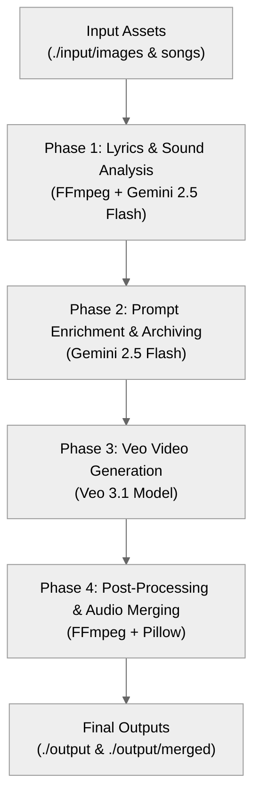

### Pipeline Phase Mapping

| Phase | Role | Core Stack | Input / Output Path |
| :--- | :--- | :--- | :--- |
| **Phase 1** | Audio extraction, lyrics transcription & style analysis | FFmpeg, Gemini 2.5 Flash File API | `./input/songs/` -> `./input/lyrics/*.txt` |
| **Phase 2** | Multimodal prompt synthesis & sequential archiving | Gemini 2.5 Flash, `config_prompts.json` | `./input/images/` -> `./input/prompts/*.txt` |
| **Phase 3** | Async 1080p 16:9 video generation & polling | Google Veo 3.1 Model (`veo-3.1-generate-preview`) | `./input/prompts/*.txt` -> `./output/*.mp4` |
| **Phase 4** | Video verification, crossfade & audio merging | FFmpeg, Pillow (PIL) | `./output/*.mp4` -> `./output/merged/*.mp4` |

---

## 2. System Sequence Diagram

The sequence diagram below illustrates the interactions among all system components, from execution and audio processing to Gemini multimodal analysis, async Veo video generation polling, and audio-visual post-processing.

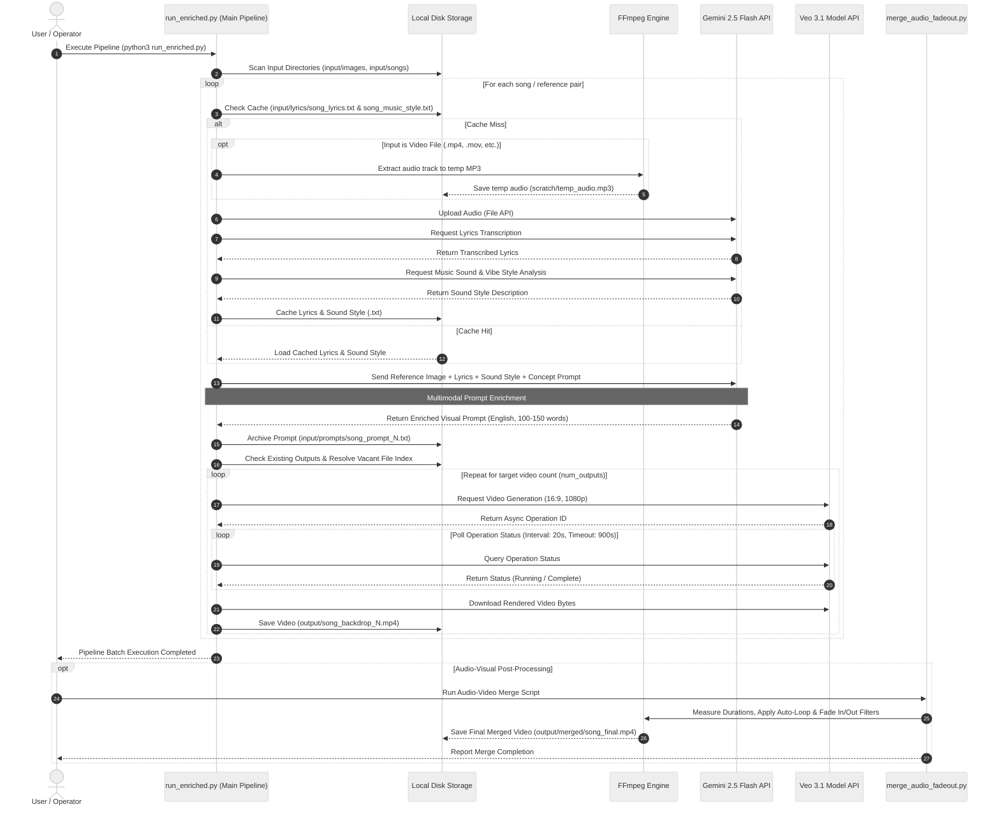

---

## 3. Detailed Phase Specifications

### Phase 1: Audio, Lyrics & Music Style Analysis

Extracts audio from input media, transcribes lyrics, and analyzes sound style using the Gemini File API. Includes a local caching layer to avoid duplicate API requests.

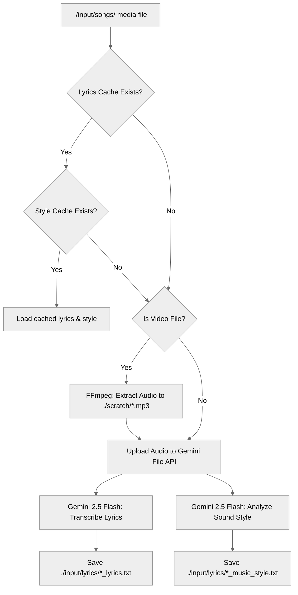

---

### Phase 2: Multimodal Prompt Enrichment & Archiving

Synthesizes detailed visual prompts optimized for Veo by combining style reference images, transcribed lyrics, sound style descriptions, and base concepts from `config_prompts.json`.

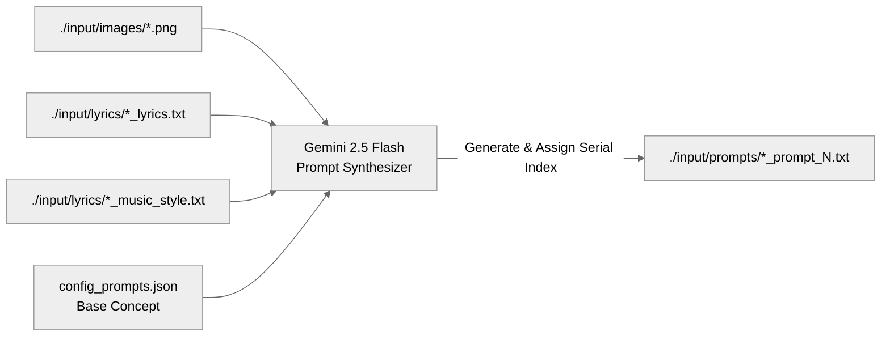

---

### Phase 3: Veo Video Generation & Polling

Sends archived prompts to the Google Veo 3.1 model, polls async operations, and downloads rendered 1080p 16:9 stage backdrop videos.

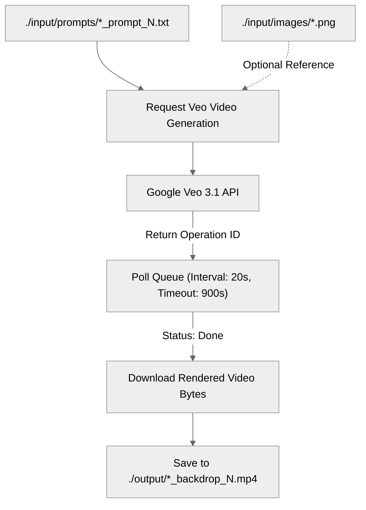

---

### Phase 4: Post-Processing & Audio-Video Merging Utilities

Validates rendered video specifications and merges backdrop videos with original audio tracks, featuring auto-looping, fade transitions, and PIL-based title overlays.

---

## 4. Component & Utility Matrix

Component matrix detailing the primary responsibilities and relationships of all project scripts and configuration files.

| Script / File | Core Responsibilities | Key Dependencies |
| :--- | :--- | :--- |
| `run_enriched.py` | Main batch pipeline. Executes Phases 1 through 3 sequentially | `google-genai`, `python-dotenv`, FFmpeg |
| `run_single_prompt.py` | CLI utility to select an archived prompt file and generate additional videos | `google-genai`, `python-dotenv` |
| `merge_audio_fadeout.py` | Audio-video merging tool. Features video auto-looping, fade in/out, and text overlay | FFmpeg, `pillow` |
| `merge_videos.py` | Video concatenation utility with crossfade transitions | FFmpeg |
| `analyze_videos.py` | Verification utility for checking resolution, frame rate, and video duration | `google-genai`, FFmpeg |
| `config_prompts.json` | Pipeline configuration defining models, output paths, polling limits, and per-song concepts | JSON |

---

## 5. Directory Mapping Specification

| Directory Path | Purpose & Managed Assets | Git Tracked |
| :--- | :--- | :--- |
| **`./input/images/`** | Style reference images defining color palettes and mood (`.png`, `.jpg`) | `.gitkeep` tracked, images ignored |
| **`./input/songs/`** | Original audio/video reference media files | `.gitkeep` tracked, media files ignored |
| **`./input/lyrics/`** | Cached text files containing Gemini lyrics transcriptions and sound style analyses (`*.txt`) | `.gitkeep` tracked, cache files ignored |
| **`./input/prompts/`** | Archived enriched visual prompts with incremental numbering (`*.txt`) | `.gitkeep` tracked, prompt history ignored |
| **`./output/`** | Final 1080p 16:9 stage backdrop videos generated by Veo | `.gitkeep` tracked, generated videos ignored |
| **`./output/merged/`** | Final production videos with merged audio, fade effects, and crossfade concatenation | Directory auto-created |
| **`./scratch/`** | Temporary workspace for FFmpeg audio extraction and title text image generation | `.gitkeep` tracked, temp files ignored |

---

## 6. Security & Configuration Spec

1. **Credential Security**:
   - The Gemini API key is injected strictly via the environment variable (`GEMINI_KEY`), and the `.env` file is excluded from version control via `.gitignore`.
   - `.env.example` is provided as a template for environment configuration in public repositories.

2. **Async Polling & Resilience**:
   - Accounts for Veo video generation time (1 to 3 minutes) with `polling_interval_sec` (default: 20s) and `polling_timeout_sec` (default: 900s).
   - Includes retry logic for network and API failures to guarantee continuous batch execution.

---

[English](#english) | [한국어](#korean)

# AI 기반 콘서트 무대 백월 영상 생성기 아키텍처 (AI-Powered Concert Stage Backdrop Generator Architecture)

본 문서는 Google Gemini 및 Veo 모델을 활용한 콘서트 무대 배경(Stage Backdrop) 비디오 자동화 생성 시스템의 엔드투엔드(End-to-End) 아키텍처 및 모듈 구조를 명세합니다.

---

## 1. 전체 시스템 개요 (High-Level System Overview)

본 시스템은 원본 참고 미디어(음원/영상)와 스타일 이미지 자산을 분석하여 무대 연출용 최적화 프롬프트를 생성하고, 고해상도(1080p 16:9) 백월 영상을 생성 및 후처리하는 4단계 파이프라인으로 구성되어 있습니다.

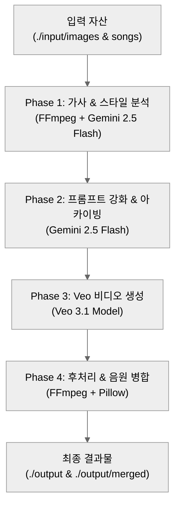

### 파이프라인 단계별 핵심 역할 (Pipeline Phase Mapping)

| 단계 (Phase) | 역할 (Role) | 핵심 기술 및 모델 (Core Stack) | 입력 / 출력 경로 (Input / Output Path) |
| :--- | :--- | :--- | :--- |
| **Phase 1** | 오디오 추출, 가사 전사 및 음악 스타일 분석 | FFmpeg, Gemini 2.5 Flash File API | `./input/songs/` -> `./input/lyrics/*.txt` |
| **Phase 2** | 멀티모달 프롬프트 합성 및 넘버링 보관 | Gemini 2.5 Flash, `config_prompts.json` | `./input/images/` -> `./input/prompts/*.txt` |
| **Phase 3** | 비동기 1080p 16:9 무대 비디오 생성 및 폴링 | Google Veo 3.1 Model (`veo-3.1-generate-preview`) | `./input/prompts/*.txt` -> `./output/*.mp4` |
| **Phase 4** | 비디오 해상도 검증, 크로스페이드 및 음원 병합 | FFmpeg, Pillow (PIL) | `./output/*.mp4` -> `./output/merged/*.mp4` |

---

## 2. 전체 시스템 시퀀스 다이어그램 (System Sequence Diagram)

다음 시퀀스 다이어그램은 사용자 실행부터 오디오 추출, Gemini 멀티모달 분석, Veo 비동기 생성 폴링 및 음원 병합 유틸리티까지의 전체 컴포넌트 간 상호작용을 나타냅니다.

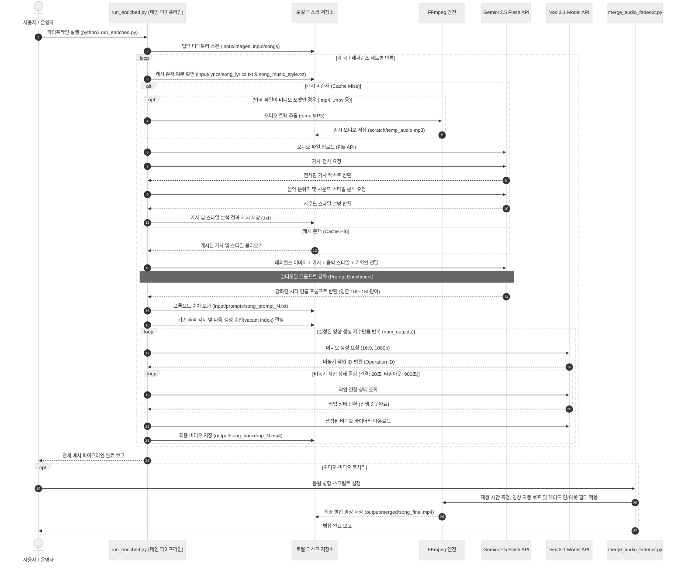

---

## 3. 단계별 상세 아키텍처 (Detailed Phase Specifications)

### Phase 1: 오디오, 가사 및 음악 스타일 분석 (Audio, Lyrics & Music Style Analysis)

입력 미디어 파일에서 오디오를 추출하고, Gemini File API를 통해 가사 전사 및 사운드 스타일(템포, 분위기, 주요 악기 구성 등)을 분석합니다. 동일 곡에 대한 중복 API 호출을 방지하기 위해 로컬 캐시 레이어를 제공합니다.

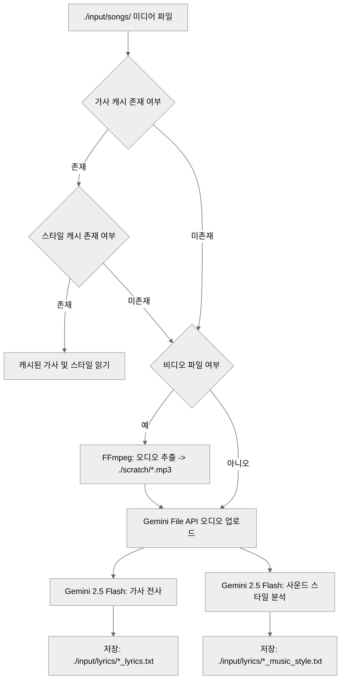

---

### Phase 2: 멀티모달 프롬프트 강화 및 아카이빙 (Prompt Enrichment & Archiving)

스타일 레퍼런스 이미지, 전사된 가사, 음악 스타일 분석 결과 및 `config_prompts.json`에 정의된 기본 연출 기획안을 결합하여, Veo 비디오 생성 모델이 이해하기 최적화된 영문 시각 연출 프롬프트를 합성합니다.

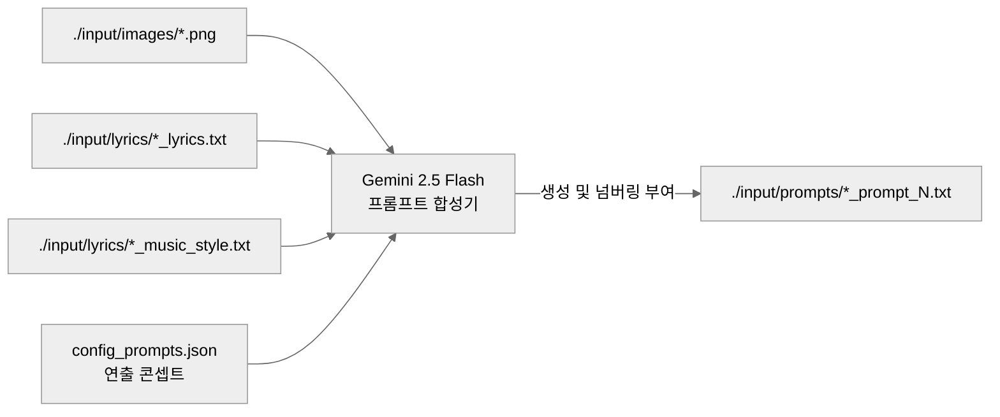

---

### Phase 3: 고해상도 비디오 생성 및 비동기 폴링 (Veo Video Generation & Polling)

아카이빙된 연출 프롬프트를 Google Veo 3.1 모델(`veo-3.1-generate-preview`)에 전송하고, 비동기 작업(Operation ID) 상태를 지속적으로 폴링하여 완결된 1080p 16:9 비디오 데이터를 수신합니다.

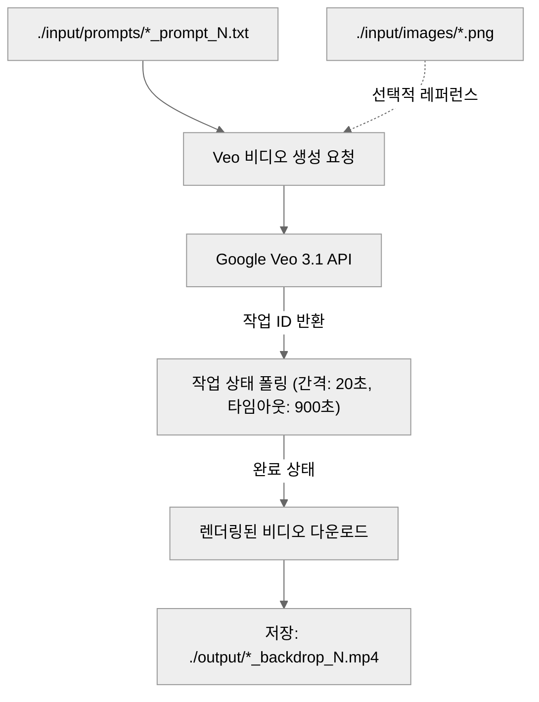

---

### Phase 4: 후처리 및 오디오-비디오 병합 유틸리티 (Post-Processing & Audio-Video Merging Utilities)

렌더링된 비디오의 해상도 및 길이 유효성을 검증하고, 백월 비디오와 원본 음원을 합치며 자동 루프, 페이드 인/아웃, Title Text Overlay를 적용합니다.

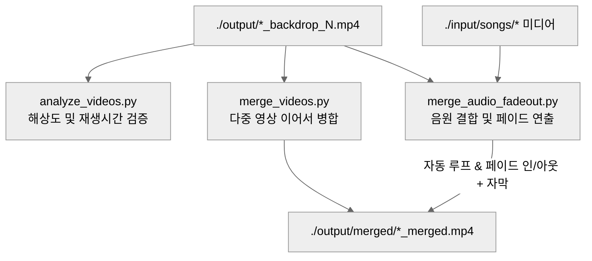

---

## 4. 모듈 및 유틸리티 매트릭스 (Component & Utility Matrix)

시스템을 구성하는 주요 파일과 유틸리티 스크립트의 역량을 정리한 매트릭스입니다.

| 스크립트 / 파일 | 역할 및 주요 기능 | 주요 의존성 |
| :--- | :--- | :--- |
| `run_enriched.py` | 메인 배치 파이프라인. Phase 1~3 전체 프로세스를 순차 실행 | `google-genai`, `python-dotenv`, FFmpeg |
| `run_single_prompt.py` | 저장된 프롬프트 파일 선택 후 추가 영상만 단독 생성하는 CLI 유틸리티 | `google-genai`, `python-dotenv` |
| `merge_audio_fadeout.py` | 비디오와 음원 결합. 영상 자동 루프, 페이드 인/아웃, 텍스트 자막 오버레이 적용 | FFmpeg, `pillow` |
| `merge_videos.py` | 여러 개별 백월 비디오를 크로스페이드로 이어붙여 긴 무대 영상 작성 | FFmpeg |
| `analyze_videos.py` | 생성된 비디오 파일의 해상도, 프레임 레이트, 재생 시간 유효성 검증 | `google-genai`, FFmpeg |
| `config_prompts.json` | 모델 설정, 출력 경로, 폴링 시간 및 곡별 연출 콘셉트 기획안 정의 | JSON |

---

## 5. 디렉토리 구조 및 데이터 매핑 (Directory Mapping Specification)

| 디렉토리 경로 | 용도 및 보관 데이터 | Git 추적 여부 |
| :--- | :--- | :--- |
| **`./input/images/`** | 무대 비디오 연출에 참조할 레퍼런스 스타일 이미지 (`.png`, `.jpg`) | `.gitkeep` 추적, 이미지 파일 제외 |
| **`./input/songs/`** | 가사 및 음악 분위기 분석 대상 원본 오디오/비디오 미디어 | `.gitkeep` 추적, 미디어 파일 제외 |
| **`./input/lyrics/`** | Gemini가 분석한 가사 및 음악 스타일 결과 캐시 텍스트 (`*.txt`) | `.gitkeep` 추적, 캐시 파일 제외 |
| **`./input/prompts/`** | 회차별 순차 아카이빙된 강화 연출 영문 프롬프트 (`*.txt`) | `.gitkeep` 추적, 프롬프트 이력 제외 |
| **`./output/`** | Veo 모델이 생성한 곡별 최종 1080p stage backdrop 영상 | `.gitkeep` 추적, 생성 영상 제외 |
| **`./output/merged/`** | 음원 결합, 페이드 효과 및 크로스페이드가 완료된 최종 상영용 영상 | 폴더 자동 생성 |
| **`./scratch/`** | 오디오 추출 및 자막 이미지 생성을 위한 임시 작업 디렉토리 | `.gitkeep` 추적, 임시 파일 제외 |

---

## 6. 보안 및 환경 설정 명세 (Security & Configuration Spec)

1. **인증 정보 보호 (Credential Security)**:
   - Gemini API 키는 환경 변수(`GEMINI_KEY`)로만 주입되며, `.env` 파일은 `.gitignore`를 통해 버전 관리 대상에서 차단됩니다.
   - 공개 저장소 배포용 템플릿으로 `.env.example`을 제공합니다.

2. **비동기 폴링 및 재시도 메커니즘 (Polling & Resilience)**:
   - Veo 영상 생성의 평균 소요 시간(1~3분)을 고려하여 `polling_interval_sec` (기본값: 20초) 및 `polling_timeout_sec` (기본값: 900초) 설정으로 비동기 작업을 안정적으로 관리합니다.
   - 네트워크 및 API 오류 시 재시도 로직이 적용되어 배치 작업의 연속성을 보장합니다.
